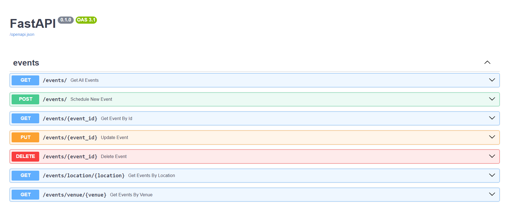

# Events API

An API that manage events, You can do CRUD methods on the data.
The data is stored in a sqlite DB.
There is a reminder service who reminds half a hour before the event starts. 

## Description

In the project there is the domain layer and the app layer
in the domain I set at the abstract repositories and the entities, 
the abstract format of the services.
The event's repo is observable (notify the objects that subscribe about changes in it)
The project implements an API for those operations.





The reminder services is an observer of the repo runs in a different thread. 
Keeps as inner attribute the copy of the events repo and making the checks on it.

## Getting Started

### Dependencies

* python 3.10


### Installing

* pip install -r requirements.txt

### Executing program

```
uvicorn main:app --reload
```

## Help

Docs of the API at http://127.0.0.1:8000/docs

## Authors
  
* Yuval Fein
